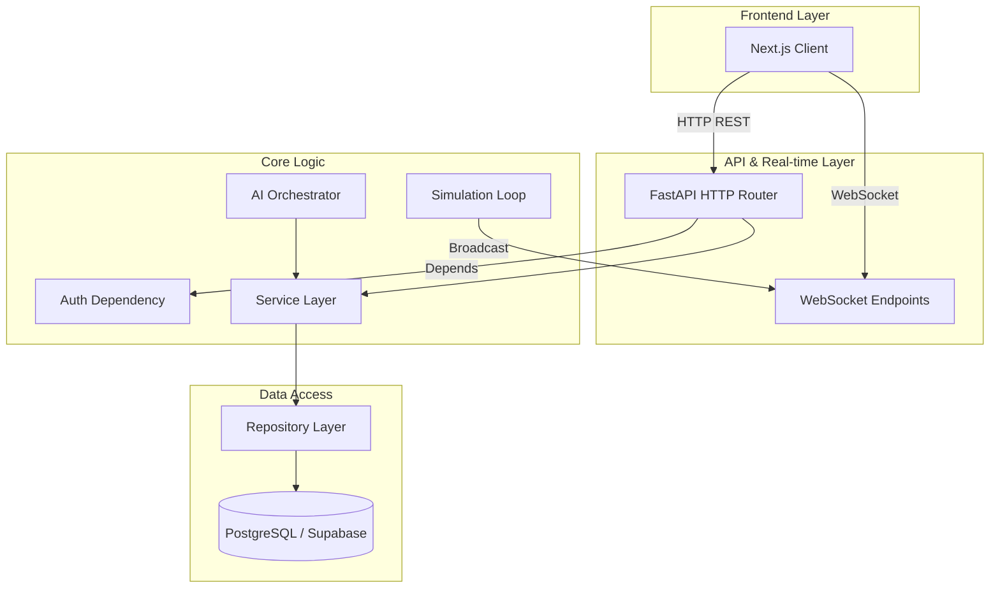

# BharatOS Backend System Architecture Specification

This document details the system design, architectural layers, data flows, and structural layout of the backend platform supporting the **BharatOS Command-Center & Digital Twin**.

---

## 1. System Overview

BharatOS utilizes a **modular monolith** backend built on the **FastAPI** web framework. The backend provides versioned RESTful APIs, full-duplex WebSockets for real-time telemetry streaming, and acts as an agentic gateway integrating with the database and AI LLMs (Gemini API).

### Architectural Stack
- **Web Framework**: FastAPI (Asynchronous ASGI server, Pydantic data validation)
- **Database**: PostgreSQL (Supabase managed instance)
- **ORM / Query Engine**: SQLAlchemy v2.0 (Mapped Column Declarative mappings)
- **Real-time Engine**: Python `asyncio` loops streaming JSON payloads via WebSockets
- **Authentication**: JWT token verification based on Supabase Auth signatures
- **Cognitive Layer**: Google Gemini SDK (Agentic triage engine)

---

## 2. Core Architectural Layers



### 2.1. API & WebSockets Router Layer
- **Versioned Routers (`/api/v1`)**: Handles standard REST endpoints for CRUD operations (auth syncing, incident tracking, analytics fetches).
- **WebSocket Routers (`/ws`)**: Manages long-lived client connections grouped by distinct topics (`dashboard`, `incidents`, `sensors`, `notifications`).

### 2.2. Core Middleware & Dependencies
- **Authentication Dependency (`get_supabase_user`)**: Extracts the Bearer JWT token from incoming headers, contacts the Supabase API to retrieve user profiles, and yields verified users.
- **Database Dependency (`get_db`)**: Instantiates scoped SQLAlchemy `Session` connections per request, ensuring automatic transaction commits/rollbacks and cleanup.

### 2.3. Service Layer (Business Logic)
- **Incident Service**: Houses validation, ticket number generation, assignment pipelines, and transitions statuses.
- **Sensor Engine**: Background task driven by `asyncio` which simulates IoT telemetry fluctuations (e.g. storm drain levels) and dispatches real-time critical warnings.
- **AI Orchestrator**: Wraps prompts, invokes the Gemini API, and structures the unstructured incident content into clean, categorized JSON formats.
- **Facility Service**: Manages validation, pagination, geographic scope checks, and auditing for fixed physical emergency infrastructure.
- **Alert Service**: Manages validation, transitions, geographic scope checks, automatic expiration, and auditing for emergency alerts.
- **Alert Rule Service**: Evaluation engine applying deterministic thresholds against incoming telemetry (e.g., water levels, AQI, temperature) to generate alerts with integrated temporal/spatial deduplication.

### 2.4. Repository & Data Access Layer
- Translates service-level requests into database commands using SQLAlchemy ORM syntax.
- Manages relational joins, index lookups, and transaction boundaries.
- **Facility Repository**: Executes queries on the `facilities` table, filtering by type, state, district, city, zone, ward, and source type.
- **Alert Repository**: Executes queries on the `alerts` table, performing filtering, aggregations, status/severity counts, and atomic writes.


---

## 3. Real-Time Telemetry Design

Real-time streaming is achieved using a centralized `ConnectionManager` class that maintains connection groups per topic, wrapped in `ActiveConnection` objects containing authenticated geographic scopes:

1. **`dashboard`**: Receives structural network health statuses, active incident totals, and server load telemetry.
2. **`incidents`**: Streams raw incident creations, status updates, and dispatch confirmations to active command-center screens.
3. **`sensors`**: Receives granular IoT readings (temperature, water levels, hazard diagnostics) updated every few seconds.
4. **`notifications`**: Dispatches high-priority system alerts and push notices.

```python
class ActiveConnection:
    def __init__(self, websocket: WebSocket, user_id: uuid.UUID, role_name: str, state_id: Optional[uuid.UUID], district_id: Optional[uuid.UUID], city_id: Optional[uuid.UUID]):
        self.websocket = websocket
        self.user_id = user_id
        self.role_name = role_name
        self.state_id = state_id
        self.district_id = district_id
        self.city_id = city_id

class ConnectionManager:
    def __init__(self):
        self.active_connections: Dict[str, List[ActiveConnection]] = {
            "dashboard": [],
            "incidents": [],
            "sensors": [],
            "notifications": []
        }
    
    async def connect(self, topic: str, active_conn: ActiveConnection):
        # Accepts connection and registers user attributes in memory
    
    async def broadcast(self, topic: str, message: dict, db: Optional[Session] = None):
        # Evaluates geographic scope of message against user role/location attributes,
        # ensuring operators only receive events matching their authorization boundary.
```

### 3.1. DB Transaction → Event Ordering
To guarantee database consistency, WebSocket events represent committed state. The pipeline enforces:
1. Start DB Transaction
2. Execute business operations (e.g. allocate resource)
3. Commit transaction successfully
4. Broadcast WebSocket event to matching scoped subscribers
If the transaction fails or rolls back, no event is broadcast, preventing dirty read anomalies on the frontend.


---

## 4. Security & Authorization Architecture

### 4.1. Token Verification & User Resolution
- **JWT Verification**: Incoming Bearer tokens are decrypted and authenticated against the configured Supabase signatures. The FastAPI dependency `get_supabase_user` retrieves the identity claims.
- **PostgreSQL Profile Resolving**: The `get_current_user` dependency resolves the local database user corresponding to the Supabase UUID.
  - If a valid token is presented but no profile is synchronized in PostgreSQL, the request fails with a `404 Not Found` to prevent un-synchronized state assumptions.

### 4.2. Role-Based Access Control (RBAC)
FastAPI dependencies (`require_role`, `require_roles`) enforce role check filters before executing endpoint logic:
- **citizen**: General public reporting incidents.
- **officer** / **dept_head**: Departmental response operators.
- **admin** / **state_admin** / **national_admin**: Administrative control.

### 4.3. Geographic Scope Enforcement
Operational scope checks are implemented at the route/service level using `verify_geographic_scope`. This logic compares the user's scope fields (`state_id`, `district_id`, `city_id`) against target resource scopes:
- **National Admins (`admin`, `national_admin`)**: Retain full read/write permission across all states.
- **State Operators**: Restrict operations strictly to the designated `state_id` and all children districts/cities.
- **District Operators**: Restrict operations strictly within the assigned `district_id` and children cities.
- **City Operators**: Restrict operations strictly within the specified `city_id`.

### 4.4. Escalation Prevention & Sync Profile
- **Sync Endpoints**: `POST /api/v1/auth/sync-profile` and `POST /api/v1/users/profile` accept safe parameters (`full_name`, `phone`) but ignore or block client-provided administrative values (`role`, `state_id`, `district_id`, `city_id`).
- **Initial Sync**: New profiles synced from the client are assigned the safe default `"citizen"` role with `null` geographic restrictions.


---

## 5. AI Orchestration & Multi-Agent Architecture

BharatOS implements a production-oriented, scope-aware multi-agent architecture that operates strictly above deterministic services and database boundaries:

### 5.1. Agent Core Package (`app/agents/`)
- **AI Orchestrator (`orchestrator.py`)**: Central entrypoint. Performs intent classification, maps messages to conversation histories, dynamically routes to specialized agents, and translates outputs to target languages (English, Telugu, Hindi).
- **Incident Agent (`incident_agent.py`)**: Analyzes, counts, and summarizes incidents within the user's geographic bounds.
- **Resource Agent (`resource_agent.py`)**: Evaluates, filters, and ranks available ambulances, fire tenders, and police units in scope.
- **Alert Agent (`alert_agent.py`)**: Aggregates active alert metrics, severity categories, and geographic impact warnings.
- **Intelligence Agent (`intelligence_agent.py`)**: Compiles comprehensive real-time situational awareness dashboards from incidents, alerts, resources, facilities, and telemetry logs.

### 5.2. Tool-Based Boundaries (`tools.py`)
- Agents retrieve data exclusively through verified API boundaries (tools) like `get_incidents`, `get_alerts`, and `get_resources`.
- Arbitrary SQL execution and code execution are strictly banned.
- **Write Authorization**: Writing tools (e.g. `create_incident`, `resolve_alert`) explicitly validate the active user's RBAC claims and enforce geographic scoping limits. 
- **Human-in-the-loop**: High-impact actions are proposed as recommendations rather than executed automatically.

### 5.3. Multilingual Support
The orchestrator performs text-based language identification. For Devanagari (Hindi) and Telugu inputs, intent classification maps to localized repositories and generates responses natively in the query language.


---

## 6. Real-time Ingestion & Public Data Integration

BharatOS integrates keyless public APIs and open data directories to retrieve and normalize Visakhapatnam emergency parameters dynamically:

### 6.1. Integrations Package (`app/integrations/`)
- **Weather Adapter (`weather/client.py`)**: Fetches temperature, relative humidity, precipitation, and wind speeds from the keyless Open-Meteo Forecast endpoint.
- **Air Quality Adapter (`air_quality/client.py`)**: Queries current AQI index, PM2.5, PM10, nitrogen dioxide, and ozone concentrations from the keyless Open-Meteo Air Quality endpoint.
- **Facilities Client (`facilities/client.py`)**: Submits bounding-box geocoded queries to the OpenStreetMap Overpass API, returning optimized coordinates for emergency hubs (police, fire, hospitals).
- **APSDMA Alerts**: Hardcoded to `UNAVAILABLE` in the source registry as no machine-readable public API feed is verified, avoiding fake scrapers.

### 6.2. Synchronization Service (`app/services/data_sync_service.py`)
- Coordinates adapter queries sequentially under safe `HTTP` timeouts (e.g. 5–15 seconds).
- Maps weather/AQI records to a single seeded "Vizag Weather & Air Quality Monitoring Station" Digital Twin Node (`e47ac10b-58cc-4372-a567-0e02b2c3d495`) and logs corresponding `TelemetryRecord` items.
- Implements geo-boundary coordinates validation, runs alphanumeric string-similarity deduplication heuristics, and applies a conflict resolution rule (DO NOT overwrite official/verified data with crowdsourced open-data values).
- Persists sync success metrics under `AuditLog` table using `action="DATA_INGESTION_SYNC"` and stores local snapshots under `ingestion_report.json` for compatibility.
- Exposes administrative routes `/admin/data-ingestion/status` and `/admin/data-ingestion/sync`.

### 6.3. Scoped Dashboard Overview (`dashboard.py`)
- `GET /dashboard/overview` aggregates incidents, alerts, resources, facilities, nodes, and telemetry.
- Resolves weather and AQI values from the latest monitoring station telemetry records.
- Calculates dynamic freshness status (`FRESH` < 1h, `STALE` < 4h, `EXPIRED` > 4h) and exposes detailed source url / type provenance metadata.
- Automatically bounds queries strictly to the user's geographic profile (`city_id`, `district_id`, `state_id`).


