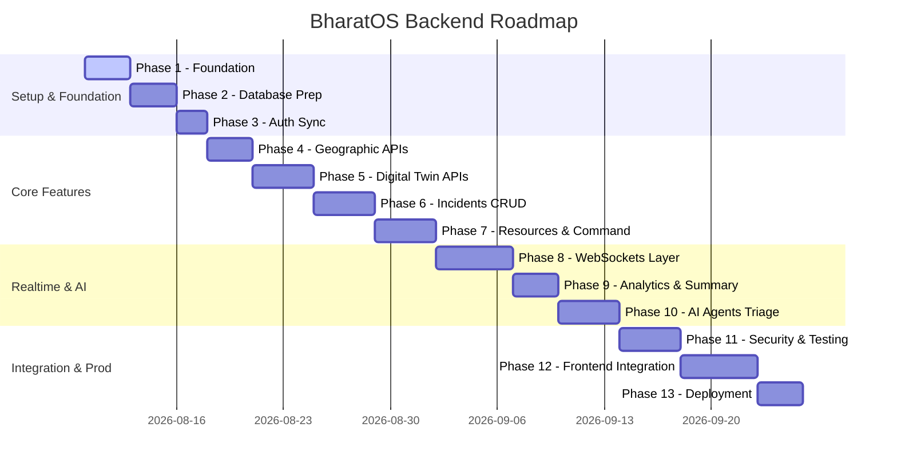

# BharatOS Backend Development Roadmap

This document outlines the detailed development phases, implementation steps, dependencies, database enhancements, testing specifications, and completion criteria for the **BharatOS FastAPI Backend**.

---

## Roadmap Overview

---

## Phases & Milestone Specifications

### PHASE 1 — Backend Foundation
- **Objective**: Establish the development workspace, environment files, package dependencies, and dockerization bases.
- **Tasks**:
  1. Set up standard Python venv and freeze backend packages in `requirements.txt` (`fastapi`, `uvicorn`, `sqlalchemy`, `pydantic-settings`, `psycopg`, `supabase`).
  2. Create standard `.env.example` detailing keys for DB connection string, Supabase Auth tokens, and Gemini API keys.
  3. Verify FastAPI startup using health check endpoint (`/api/v1/health`).
- **Dependencies**: None.
- **APIs**: `GET /api/v1/health`, `GET /api/v1/system/info`.
- **Database Changes**: None.
- **Testing**: Manual check of `/docs` endpoint loading successfully.
- **Completion Criteria**: Uvicorn server starts cleanly with `0` dependency resolution errors.

---

### PHASE 2 — Database Initialization & Migrations
- **Objective**: Execute DDL schemas on PostgreSQL/Supabase and setup Alembic migrations.
- **Tasks**:
  1. Configure Alembic migration repository inside the `backend` directory.
  2. Initialize connection engine and run DDL foundational scripts (`01_foundational_schema.sql`, `02_incidents_schema.sql`).
  3. Seed roles (`citizen`, `officer`, `dept_head`, `admin`, `state_admin`, `national_admin`) and municipal departments (`POLICE`, `FIRE`, `HEALTH`, `MUNICIPAL`, `DISASTER`).
- **Dependencies**: Database access credentials (Supabase/PostgreSQL).
- **APIs**: None.
- **Database Changes**: Creation of 13 foundational schemas.
- **Testing**: DB check validating seeded role entries.
- **Completion Criteria**: `alembic upgrade head` runs with `0` transaction errors.

---

### PHASE 3 — Authentication & User Profiling Sync
- **Objective**: Bind user sign-ups client-side to PostgreSQL database profiles.
- **Tasks**:
  1. Configure the Bearer auth handler to inspect JWT tokens and verify signatures.
  2. Implement user profile sync handler endpoint (`POST /users/profile`).
  3. Enable `/auth/me` request handling.
- **Dependencies**: Phase 2 completed.
- **APIs**: `POST /api/v1/users/profile`, `GET /api/v1/auth/me`.
- **Database Changes**: None.
- **Testing**: Send a request with a valid JWT token; verify it creates a record in the `users` table.
- **Completion Criteria**: Verified user context can be extracted from JWT payload.

---

### PHASE 4 — Geographic API Services [COMPLETE]
- **Objective**: Expose the geographical state, district, city, zone, and ward hierarchy.
- **Tasks**:
  1. Implement versioned REST endpoints to query States, Districts, Cities, Zones, and Wards.
  2. Integrate authentication and geographic scope authorization rules.
  3. Support pagination and N+1 query optimization using joined load strategy.
- **Dependencies**: Phase 3 completed.
- **APIs**: `GET /api/v1/states`, `GET /api/v1/states/{id}`, `GET /api/v1/states/{id}/districts`, `GET /api/v1/districts/{id}`, `GET /api/v1/districts/{id}/cities`, `GET /api/v1/cities`, `GET /api/v1/cities/{id}`, `GET /api/v1/cities/{id}/zones`, `GET /api/v1/zones/{id}/wards`, `GET /api/v1/wards/{id}`.
- **Database Changes**: Verified models mapping states, districts, cities, zones, and wards.
- **Testing**: Added unit and integration tests inside `tests/test_geography.py` covering all 20 scenarios.
- **Completion Criteria**: All tests pass and endpoints conform to response schemas.

---

### PHASE 5 — Digital Twin Topology APIs
- **Objective**: Expose registered network node points and connecting links.
- **Tasks**:
  1. Create database schema tables `digital_twin_nodes` and `node_connections`.
  2. Expose REST endpoints to retrieve active nodes and connection state maps.
- **Dependencies**: Phase 4 completed.
- **APIs**: `GET /api/v1/digital-twin/nodes`, `GET /api/v1/digital-twin/connections`, `GET /api/v1/digital-twin/summary`.
- **Database Changes**: Tables `digital_twin_nodes` and `node_connections` created.
- **Testing**: Retrieve nodes; verify they map to geographic coordinates.
- **Completion Criteria**: Map layer nodes feed data correctly.

---

### PHASE 6 — Incidents & Alerts Management
- **Objective**: CRUD pipeline for managing citizen-reported incidents.
- **Tasks**:
  1. Build the create incident pipeline.
  2. Implement listing and status updates.
- **Dependencies**: Phase 3 and 5 completed.
- **APIs**: `GET /api/v1/incidents`, `POST /api/v1/incidents`, `GET /api/v1/incidents/{id}`, `PATCH /api/v1/incidents/{id}/status`, `POST /api/v1/incidents/{id}/assign`, `DELETE /api/v1/incidents/{id}`.
- **Database Changes**: Incidents pipeline tables active.
- **Testing**: Test incident status transitions (`active` -> `assigned` -> `in_progress` -> `resolved`).
- **Completion Criteria**: Incidents CRUD functions securely.

---

### PHASE 7 — Resources & Command Centers
- **Objective**: Deploy and allocate emergency response units (police vehicles, fire engines, emergency beds).
- **Tasks**:
  1. Implement resource registry and tracking.
  2. Create dispatch pipelines linking incidents to department resources.
- **Dependencies**: Phase 6 completed.
- **APIs**: `GET /api/v1/resources`, `POST /api/v1/resources/dispatch`, `GET /api/v1/command-centers`.
- **Database Changes**: Resource allocation tables.
- **Testing**: Verify assigning resources updates the resource status.
- **Completion Criteria**: Dispatch operations successfully link resources to incident tickets.

---

### PHASE 7.5 — Visakhapatnam Data Foundation
- **Objective**: Seed a credible Andhra Pradesh -> Visakhapatnam geographic and operational dataset.
- **Tasks**:
  1. Add Visakhapatnam geography (AP State, Visakhapatnam District, Visakhapatnam City, Zone 1, Ward 12).
  2. Seed simulated command centers, nodes, node connections, departments, and resources.
- **APIs**: None (uses existing geographic, resource, and command center endpoints).
- **Database Changes**: Populated standard geographic and digital twin tables with Vizag-focused demo entries.
- **Testing**: Verify that `python app/db/seed.py` is idempotent and correctly links all geographic records.
- **Completion Criteria**: Seeding runs without duplicates or constraint violations.

---

### PHASE 8A — Facility Data Foundation
- **Objective**: Establish the database, repository, service, schema, and API route layer for fixed physical emergency infrastructure (Facilities).
- **Tasks**:
  1. Define Facility SQLAlchemy model with geographic scope links and source provenance attributes.
  2. Implement database migrations using Alembic.
  3. Code repository and service layer with RBAC checks and geographic scope verification.
  4. Expose facilities API endpoints (`GET /facilities`, `GET /facilities/{id}`, `POST /facilities`, `PATCH /facilities`).
  5. Add test coverage for all CRUD and authorization paths.
- **APIs**: `GET /api/v1/facilities`, `GET /api/v1/facilities/{id}`, `POST /api/v1/facilities`, `PATCH /api/v1/facilities/{id}`.
- **Database Changes**: Added `facilities` table.
- **Testing**: Run pytest to check facilities access levels and scope constraints.
- **Completion Criteria**: All tests pass and OpenAPI specs correctly register facilities endpoints.

---

### PHASE 8 — WebSocket Real-Time Telemetry Layer
- **Objective**: Full-duplex JSON messaging streams for live command hubs.
- **Tasks**:
  1. Activate the `ConnectionManager` class.
  2. Connect the `SensorEngine` simulation loops to push live telemetry.
- **Dependencies**: Phase 6 completed.
- **APIs**: `ws://localhost:8000/ws/dashboard`, `ws://localhost:8000/ws/sensors`, `ws://localhost:8000/ws/incidents`, `ws://localhost:8000/ws/notifications`.
- **Database Changes**: None.
- **Testing**: Multiple WebSocket client connections receive matching broadcasts.
- **Completion Criteria**: Telemetry broadcasts update every 4 seconds.

---

### PHASE 9 — Alerts & Emergency Intelligence Backend [COMPLETE]
- **Objective**: Build the backend foundation for emergency alerts, lifecycle transitions, geographic scoping, telemetry rule evaluation, and audit logging.
- **Tasks**:
  1. Define Alert Pydantic validation schemas.
  2. Implement AlertRepository and AlertService with RBAC checks and geographic scope verification.
  3. Create Alert Rule Service with configuration-driven threshold rules (water level, AQI, temperature) and spatial/temporal deduplication.
  4. Expose REST endpoints: `GET /alerts`, `GET /alerts/summary`, `GET /alerts/{id}`, `POST /alerts`, `PATCH /alerts/{id}/acknowledge`, `PATCH /alerts/{id}/resolve`.
  5. Enable automatic/manual expiration check of active alerts.
  6. Add comprehensive unit/integration test coverage.
- **Dependencies**: Phase 7.5 and 8A completed.
- **APIs**: `GET /api/v1/alerts`, `GET /api/v1/alerts/summary`, `GET /api/v1/alerts/{id}`, `POST /api/v1/alerts`, `PATCH /api/v1/alerts/{id}/acknowledge`, `PATCH /api/v1/alerts/{id}/resolve`.
- **Database Changes**: Reused existing `alerts` and `audit_logs` schemas without requiring schema migrations.
- **Testing**: Added `tests/test_alerts_api.py` covering all 23 validation scenarios (transitions, rules, scopes, duplicates, aggregates).
- **Completion Criteria**: All 54 test suites pass and endpoints conform to Pydantic v2 schemas.

---

### PHASE 10 — AI Emergency Intelligence & Multi-Agent Orchestration [COMPLETE]
- **Objective**: Deploy a multi-agent routing system over BHARATOS domains to answer operational queries, compile situational reports, and recommend safety measures.
- **Tasks**:
  1. Build orchestrator package (`app/agents/`) with Incident, Resource, Alert, and Intelligence agents.
  2. Implement scope-enforcing tools to access postgres service layers securely.
  3. Wire up `POST /api/v1/ai/chat` endpoint with context support and multilingual inputs.
  4. Ensure human-in-the-loop and security constraints.
  5. Code integration test cases for all 24 scenarios.
- **Dependencies**: Phase 9 completed.
- **APIs**: `POST /api/v1/ai/chat`.
- **Database Changes**: None.
- **Testing**: Added `tests/test_ai_agents.py` with mock client verification covering all 24 agent lifecycle paths.
- **Completion Criteria**: 100% test success with previous regression checks preserved.

---

### PHASE 11 — Security, Rate-Limiting & Auditing
- **Objective**: Production security hardening.
- **Tasks**:
  1. Configure CORS policies and rate-limiting.
  2. Wire up audit logging for critical operations.
- **Dependencies**: Phase 10 completed.
- **APIs**: None.
- **Database Changes**: None.
- **Testing**: Simulate brute-force requests to verify rate limits.
- **Completion Criteria**: Rate limits trigger `429 Too Many Requests`.

---

### PHASE 12 — Frontend Integration
- **Objective**: Connect the Next.js client to the local FastAPI backend.
- **Tasks**:
  1. Point `NEXT_PUBLIC_API_URL` to local endpoints.
  2. Enable WebSocket listeners in UI elements (telemetry grids, dashboard cards).
- **Dependencies**: Phase 11 completed.
- **APIs**: All endpoints verified.
- **Database Changes**: None.
- **Testing**: Complete end-to-end user flows (report incident -> AI triage -> auto-dispatch -> real-time status update).
- **Completion Criteria**: Mock data fallbacks are disabled, and live data renders on the UI.

---

### PHASE 13 — Deployment & Operations
- **Objective**: Deployment to staging and production.
- **Tasks**:
  1. Build Docker images for web and workers.
  2. Set up automated CI/CD deployment pipelines.
- **Dependencies**: Phase 12 completed.
- **APIs**: None.
- **Database Changes**: None.
- **Testing**: Health check validation on staging server.
- **Completion Criteria**: High-availability setup running in cloud environment.
